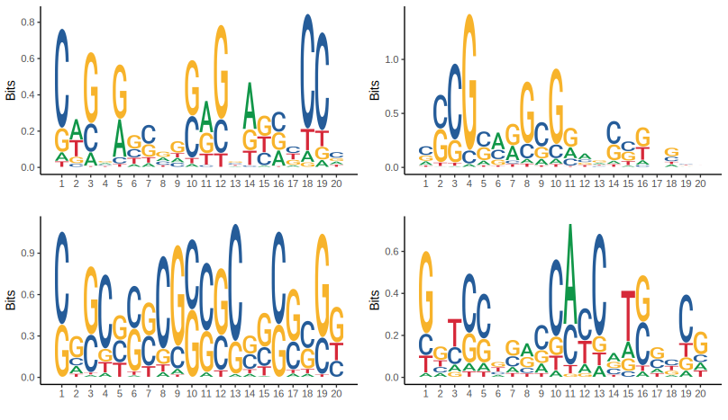
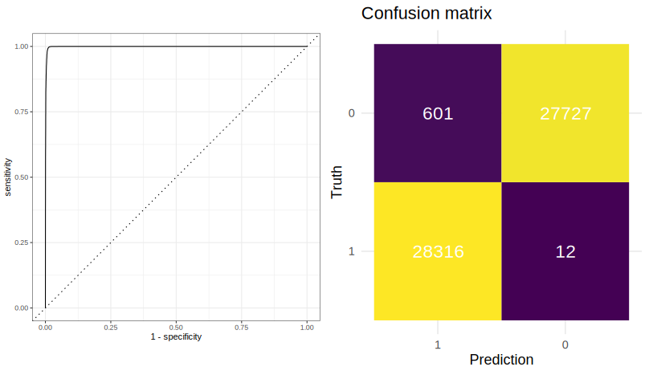

<!-- README.md is generated from README.Rmd. Please edit that file -->


<!-- ### [__DeepG4__: A deep learning approach to predict active G-quadruplexes](https://www.biorxiv.org/content/early/2020/07/23/2020.07.22.215699) -->

### **DeepG4**: A deep learning approach to predict cell-type specific active G-quadruplex regions

*Vincent Rocher, Matthieu Genais, Elissar Nassereddine and Raphael
Mourad*

<!-- badges: start -->

[](https://codecov.io/gh/morphos30/DeepG4?branch=master)
<!-- badges: end -->

**DeepG4** is a deep learning model developed to predict a score of DNA
sequences to form active G-Guadruplexes (found both in vitro and in
vivo) using **DNA sequences** and **DNA accessibility**. **DeepG4** is
built in keras+tensorflow and is wrapped in an R package.

## Requirements

DeepG4 was built with `Keras 2.3.1` and `tensorflow 2.1.0`, but it
should work with any version of theses libraries.

A very convenient way to install keras and tensorflow is using `R`. The
command line to install is from : <https://keras.rstudio.com/>.

``` r
install.packages("keras")
library(keras)
install_keras()
```

This will provide you with default CPU installations of Keras and
TensorFlow python packages (within a virtualenv) that can be used with
or without R.

## Installation

You can install the development version from
[GitHub](https://github.com/) with:

``` r
# install.packages("devtools")
devtools::install_github("morphos30/DeepG4")
```

## Basic usage of DeepG4

Given small regions (bed) and an accessibility file (coverage file from
ATAC-seq/DNAse-seq/MNase-seq), you can predict active G4 regions in a
**specific cell type**:

``` r
library(rtracklayer)
library(BSgenome.Hsapiens.UCSC.hg19)
library(DeepG4)

BED <- system.file("extdata", "test_G4_data.bed", package = "DeepG4")
BED <- import.bed(BED)
ATAC <- system.file("extdata", "Peaks_BG4_G4seq_HaCaT_GSE76688_hg19_201b_Accessibility.bw", package = "DeepG4")
ATAC <- import.bw(ATAC)

Input_DeepG4 <- DeepG4InputFromBED(BED=BED,ATAC = ATAC,GENOME=BSgenome.Hsapiens.UCSC.hg19)

Input_DeepG4
```

    [[1]]
      A DNAStringSet instance of length 100
          width seq
      [1]   201 CTGCTGGAGCCCGCCTTACTGTGGGGTGGGGGGGGTACTGCCCTAAGAACTCCAC...CCCAGCATAGACAACCGTGAAAGCCAGAAGAGCTGGCAGAGTCTAGAAGTTGGC
      [2]   201 CCCCTTGCCAGCCTACCTGGCTCAGGCCCGCCGCGCCCGCAGCCCCAGCGCGGTC...AGAGGACGCAGGCGAGAGGAACTCGGCGGCGCGGCGCCCGCGGCCTATTGGCTG
      [3]   201 CACACACACTCTTATCAGGCTGGGGCAGGCACTGGCACTGCTGAGTCACCCACAG...TGACTGCTGGGGTTTTCCTCTCCCTAGCCCTTTGATTGAGTCAGGGGTGGGGAT
      [4]   201 TCCGGCCCCGACCCCGCCCCTCCACGCCCCCAAGGAAACATGTCACTCGGGTTAC...CCACCCCGCGAGAGGCGCCGCCGGCGCCAGGTCCCAGTAGCGGGTGGGTCCTTG
      [5]   201 GTCCCCACCCCCACCCCACTCAGGGCCAGTGCCTCCCCCTCTCCCGTCAGCTCAA...CACAGATTTTTCACTTCCTGTGCAGTCAGAAAAAGAGGCTCGAGGCTCCCGCTC
      ...   ... ...
     [96]   201 CAACCTGCACAGGCCCAGCAGGGCCCCTCCAGGTCTAGGTGAGCAGAGCTCCACC...GCGTGTGGGGGCGGGATACCGACGCGGCTCGGCTGCCGATTGGTCAGAAGAGGA
     [97]   201 ATAACGCGTTGGCCCTTAAGAAAGATGGCATCTTTCCGCCTTCTCTGCCCCCTTC...GCCTGCGCCCGCGACGGAGGCGCGCTTCAAAGCGCAGGCGCGGGGAGGGGGTGG
     [98]   201 TCCCTCTCCTCTTCCACGCCCCCTTCCCACTCCTCCCCCTCCTATCCTCTCCTGG...GGGGCGCCGGGCGGCCGGCGCGCTTGGCGGCAGCCGTGGGAGGCAGGCCGGCAG
     [99]   201 GCGTATCCAGTCCCGCAGCTGACCAATCGGAGCTCGCCCTTCCGGGGCCCGCCCC...CTTCGGATCGCCGAGTAACGCTCACCAGACGTCCCGGCCCTGCCCCTCACCTGA
    [100]   201 TTTAATCTGACTCATCTCCTTTGTAAACAGTAAGGTTATTGAGGGTGAAGATTAG...AAGGTGCCGCGTTTATAAAACTCACCCAAGGTTGGCCGGACGCAGTGGCTTACG

    [[2]]
      [1] 0.007955412 0.071087932 0.035285844 0.039676268 0.044947411 0.046581121 0.023230827 0.012387618 0.082391016
     [10] 0.063834818 0.105390005 0.070236574 0.045107473 0.014299864 0.050958029 0.067799521 0.037895024 0.070339336
     [19] 0.106714671 0.028458963 0.043110214 0.019460409 0.045468318 0.051063822 0.072862518 0.021933521 0.040137615
     [28] 0.031299792 0.047589241 0.043257913 0.049913830 0.045461665 0.059799129 0.052672064 0.035330758 0.018697152
     [37] 0.048048701 0.028188545 0.041206733 0.064739781 0.044424973 0.038454479 0.049460457 0.013845773 0.054174495
     [46] 0.073740380 0.025285314 0.019293648 0.060486579 0.048533711 0.069902835 0.082091662 0.047145092 0.062299390
     [55] 0.050818736 0.050709304 0.052714895 0.082551809 0.059438781 0.015752492 0.033484694 0.016623619 0.036711227
     [64] 0.066732034 0.070644726 0.028875399 0.028216949 0.062955818 0.078560801 0.036991223 0.024028454 0.090778897
     [73] 0.063415825 0.060858383 0.074535469 0.031581759 0.029659617 0.016819003 0.046221665 0.048693290 0.014504552
     [82] 0.028334125 0.061296958 0.038678159 0.070923668 0.026397743 0.046453539 0.035868461 0.084673908 0.050543118
     [91] 0.042999488 0.034977892 0.040536342 0.039773488 0.077641724 0.055479821 0.053179943 0.039231167 0.068145290
    [100] 0.013834445

Then predict using both **DNA** and **Accessibility** :

``` r
predictions <- DeepG4(X=Input_DeepG4[[1]],X.atac = Input_DeepG4[[2]])
head(predictions)
```

              [,1]
    [1,] 0.9280036
    [2,] 1.0000000
    [3,] 0.9964566
    [4,] 0.9999996
    [5,] 0.9999791
    [6,] 0.9999921

## Advanced usage of DeepG4

If you have a large sequence (&gt;201bp up to several Mbp), you can scan
the sequence and predict the positions of active G4s within the
sequence.

``` r
library(Biostrings)
library(DeepG4)
sequences <- readDNAStringSet(system.file("extdata", "promoters_seq_example.fa", package = "DeepG4"))
res <- DeepG4Scan(X = sequences,k=20,treshold=0.5)
```

DeepG4Scan function scans each input sequence with a step of `k=20` and
outputs for each input sequence the G4 positions (+/- 100bp) and the
corresponding DeepG4 probabilities (&gt;= treshold).

``` r
library(dplyr)
res %>% dplyr::select(-seq) %>% group_by(seqnames) %>% dplyr::slice(1:2) %>%  head
```

    # A tibble: 6 x 5
    # Groups:   seqnames [3]
      seqnames start   end width score
         <int> <int> <int> <int> <dbl>
    1        1  1241  1441   201 0.670
    2        1  1261  1461   201 0.659
    3        2  1481  1681   201 0.648
    4        2  1521  1721   201 0.517
    5        3  2161  2361   201 0.723
    6        3  2181  2381   201 0.998

## SNP effect on g-quadruplex using DeepG4

Using our model, you can predict the potential effect of a SNP on active
G4 formation :

``` r
# Function to obtain ref/alt DNA sequences from the SNP coordinates
GetSeqFromSNPs <- function(my_granges,wsize = 201){
    SNP_pos <- (wsize - 1)/2 + 1 
    ## Compute Fasta
    SNps.seq.ref <- my_granges %>% anchor_center() %>% mutate(width = wsize) %>% getSeq(BSgenome.Hsapiens.UCSC.hg19.masked,.)
    ## Replace ref by alt
    sampleMat <- matrix(FALSE,nrow = length(SNps.seq.ref),ncol = nchar(SNps.seq.ref[1]))
    sampleMat[,SNP_pos] <- TRUE
    SNps.seq.alt <- replaceLetterAt(SNps.seq.ref, sampleMat, my_granges$alt)
    return(c(SNps.seq.ref,SNps.seq.alt))
}
# Libraries
require(GenomicRanges)
require(Biostrings)
require(dplyr)
require(plyranges)
require(BSgenome.Hsapiens.UCSC.hg19.masked)
# Make a GRanges object from two known SNPs
## Genomic positions
SNPs <- GRanges(c("chr16:87350773","chr19:50093572"))
## Name and ref/alt alleles
SNPs$name <- c("rs3748393","rs7249925")
SNPs$ref <- c("C","A")
SNPs$alt <- c("A","G")

## Apply our function to get the ref/alt sequence
SNPs_seq <- SNPs %>% GetSeqFromSNPs
## And launch DeepG4 on theses sequences
DeepG4.score <- DeepG4(SNPs_seq,log_odds=T)
SNPs$DeepG4_ref <- DeepG4.score[1:length(SNPs),]
SNPs$DeepG4_alt <- DeepG4.score[(length(SNPs)+1):nrow(DeepG4.score),]
SNPs <- SNPs %>% mutate(DeltaScore = DeepG4_alt-DeepG4_ref)
SNPs %>% as_tibble()
```

    # A tibble: 2 x 11
      seqnames    start     end width strand name    ref   alt   DeepG4_ref DeepG4_alt DeltaScore
      <fct>       <int>   <int> <int> <fct>  <chr>   <chr> <chr>      <dbl>      <dbl>      <dbl>
    1 chr16    87350773  8.74e7     1 *      rs3748… C     A           1.66     -0.462      -2.12
    2 chr19    50093572  5.01e7     1 *      rs7249… A     G          -1.93      0.584       2.51

## Scan DeepG4 DNA motifs from the input sequences

Using one-hot encoding of DNA, convolution kernels (first layer of
DeepG4) can be interpreted as weighted motifs, similar to position
weight matrices (PWMs) used for DNA motifs. The function
ExtractMotifFromModel detects DeepG4 DNA motifs found in the input
sequences.

``` r
library(Biostrings)
library(DeepG4)
library(ggseqlogo)
library(cowplot)
sequences <- readDNAStringSet(system.file("extdata", "test_G4_data.fa", package = "DeepG4"))
res <- ExtractMotifFromModel(sequences,top_kernel=4)
p.pcm <- lapply(res,function(x){ggseqlogo(as.matrix(x)) + ggplot2::theme_classic(base_size=14)})
print(plot_grid(plotlist = p.pcm,ncol=2))
```



## Using DeepG4 with a new active G4 dataset

If you want to use our model architecture, but retrain with your own
dataset, you can do it by running our function `DeepG4` with
`retrain = TRUE`

``` r
library(Biostrings)
library(DeepG4)
library(rsample)

# Read positive and segative set of sequences 
sequences.pos <- readDNAStringSet(system.file("extdata", "Peaks_BG4_G4seq_HaCaT_GSE76688_hg19_201b.Fa", package = "DeepG4"))
sequences.ctrl <- readDNAStringSet(system.file("extdata", "Peaks_BG4_G4seq_HaCaT_GSE76688_hg19_201b_Ctrl_gkmSVM.Fa", package = "DeepG4"))
sequences <- c(sequences.pos,sequences.ctrl)
# Generate classes
Y <- c(rep(1,length(sequences.pos)),rep(0,length(sequences.ctrl)))
```

``` r
training <- DeepG4(sequences,Y,retrain=TRUE,retrain.path = "DeepG4_retrained.hdf5")
```

You can now take a look on the results :

``` r
library(cowplot)
p_res_train <- cowplot::plot_grid(plotlist = training[2:3])
print(p_res_train)
```



``` r
training[[4]]
```

    # A tibble: 4 x 3
      .metric     .estimator .estimate
      <chr>       <chr>          <dbl>
    1 accuracy    binary         0.976
    2 kap         binary         0.952
    3 mn_log_loss binary        11.5  
    4 roc_auc     binary         0.997
